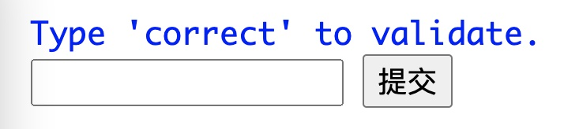
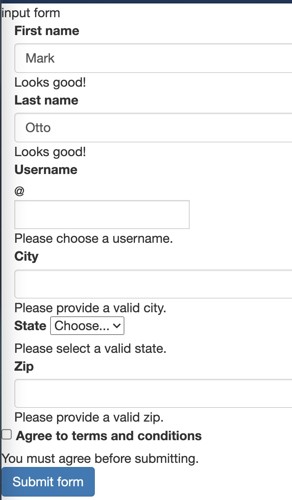
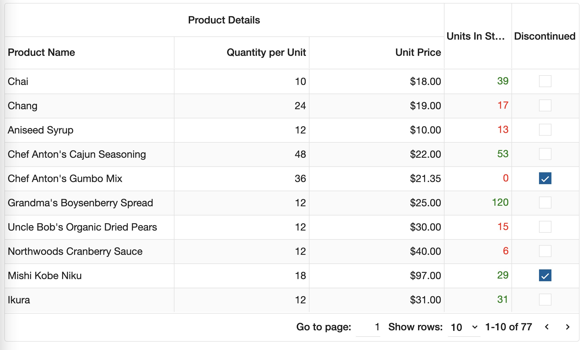
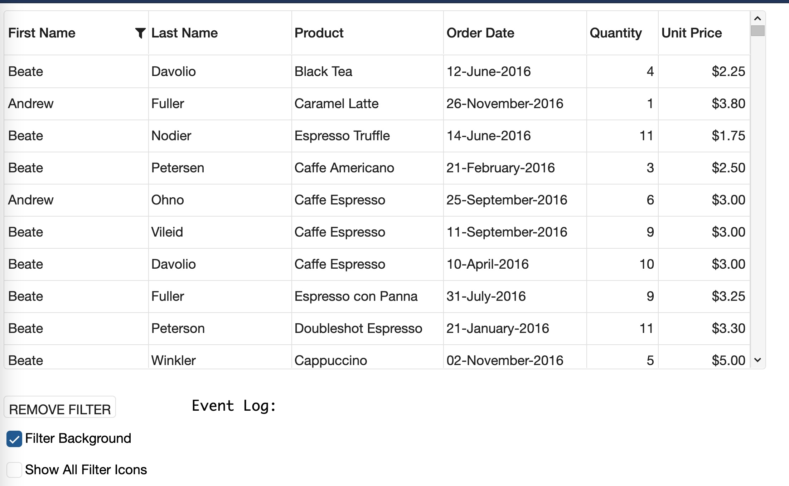

# gin-form

## build go

```bash
git clone https://github.com/marc47marc47/gin-form.git
go mod tidy
go run main.go
```

open browser go to
```bash
https://localhost:30000
```

<p>Available form samples</p>
<ol>
<li>form</li>
<li>validform</li>
<li>jqgrid</li>
<li>jqgridfilter</li>
</ol>


##form
<p></p>

##validform
<p></p>


##jqgrid
<p></p>


##jqgridfilter
<p></p>


